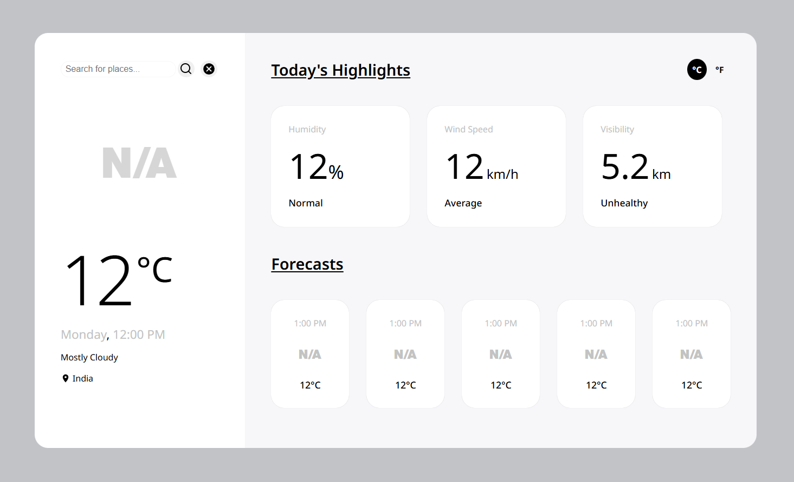

---

# Weather App

A responsive weather app built using **HTML**, **CSS**, and **JavaScript**. It fetches live weather data and displays both current and hourly forecast in a clean, modern UI.

## Features

- **Current Temperature** with °C/°F toggle
- **Condition Icon & Text**
- **Day and Time**
- **Location & Country**
- **Humidity (%)**
- **Wind Speed (km/h)**
- **Visibility (km)**

## Hourly Forecast (Up to 5 cards)

Each forecast card includes:
- Time
- Icon (from Weather Icons 2.0)
- Temperature in °C

## UI Theme

- Black, Gray, White based color scheme  
- Fully **responsive** for mobile and desktop devices

## Tech Stack

- **HTML**: Structure of the application.
- **CSS**: Styling for an intuitive and minimal design.
- **JavaScript**: Handles task management and interactions.

## API

Uses a [Weather API](https://www.weatherapi.com/) to fetch real-time data.

## Deployment

This web app is deployed using [Vercel](https://vercel.com/) by Tiger. You can access the live version here: [Weather App](https://weather-app-xi-five-57.vercel.app/)

## ScreenShots

## Getting Started

To run the app locally:

1. Clone this repository.
2. Navigate to the project folder.
3. Open `index.html` in your browser.

## License

This project is licensed under the MIT License - see the [LICENSE](LICENSE) file for details.

## Author

Made with ❤️ by Tiger

---